<p align="center"></p>
<p align="center"></p>
<h3 align="center">Showcase your skills on your GitHub or resumé with ease!</h3>
<hr>

# Docs

- [Docs](#docs)
- [Example](#example)
- [Specifying Icons](#specifying-icons)
- [Themed Icons](#themed-icons)
- [Icons Per Line](#icons-per-line)
- [Get Icons Names](#get-icons-names)
- [Centering Icons](#centering-icons)
- [Icons List](#icons-list)
  - [💖 Support the Project](#-support-the-project)

# Example

<p align="center"></p>
<p align="center"></p>

# Specifying Icons

Copy and paste the code block below into your readme to add the skills icon element!

Change the `?i=js,html,css` to a list of your skills separated by ","s! You can find a full list of icons [here](#icons-list).

```md

```


# Themed Icons

Some icons have a dark and light themed background. You can specify which theme you want as a url parameter.

This is optional. The default theme is dark.

Change the `&theme=light` to either `dark` or `light`. The theme is the background color, so light theme has a white icon background, and dark has a black-ish.

**Light Theme Example:**

```md

```


# Icons Per Line

You can specify how many icons you would like per line! It's an optional argument, and the default is 15.

Change the `&perline=3` to any number between 1 and 50.

```md

```


# Get Icons Names

You can get the possiblity to add the name of the icons you put to help others that doesnt know what they are by using `&titles`.

The value of `titles` is a boolean, so it should be `true` or `false`, default is `false`

```md

```


# Centering Icons

Want to center the icons in your readme? The SVGs are automatically resized, so you can do it the same way you'd normally center an image.

```html
<p align="center">
  <a href="https://go-skill-icons.vercel.app/">
    
  </a>
</p>
```

<p align="center">
  <a href="https://go-skill-icons.vercel.app/">
    
  </a>
</p>

# Icons List

Here's a list of all the icons currently supported. Feel free to open an issue to suggest icons to add!

<!-- START ICONS LIST -->
<table style="text-align: left; width: 100%;">
    <tr>
        <td>Icon ID</td>
        <td>Icon</td>
        <td>Icon ID</td>
        <td>Icon</td>
        <td>Icon ID</td>
        <td>Icon</td>
        <td>Icon ID</td>
        <td>Icon</td>
    </tr>
  <tr>
    <td>ableton</td>
    <td></td>
    <td>acrobat</td>
    <td></td>
    <td>activitypub</td>
    <td></td>
    <td>actix</td>
    <td></td>
  </tr>
  <tr>
    <td>adonis</td>
    <td></td>
    <td>aero</td>
    <td></td>
    <td>aftereffects</td>
    <td></td>
    <td>aiscript</td>
    <td></td>
  </tr>
  <tr>
    <td>alchemy</td>
    <td></td>
    <td>alpinejs</td>
    <td></td>
    <td>anaconda</td>
    <td></td>
    <td>androidstudio</td>
    <td></td>
  </tr>
  <tr>
    <td>angular</td>
    <td></td>
    <td>animate</td>
    <td></td>
    <td>ansible</td>
    <td></td>
    <td>anss</td>
    <td></td>
  </tr>
  <tr>
    <td>apollo</td>
    <td></td>
    <td>appcode</td>
    <td>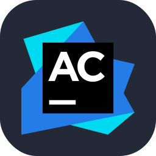</td>
    <td>apple</td>
    <td>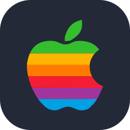</td>
    <td>appwrite</td>
    <td></td>
  </tr>
  <tr>
    <td>aqua</td>
    <td></td>
    <td>arch</td>
    <td></td>
    <td>arduino</td>
    <td></td>
    <td>argocd</td>
    <td></td>
  </tr>
  <tr>
    <td>assembly</td>
    <td></td>
    <td>astro</td>
    <td></td>
    <td>atom</td>
    <td></td>
    <td>audition</td>
    <td></td>
  </tr>
  <tr>
    <td>autocad</td>
    <td></td>
    <td>aws</td>
    <td></td>
    <td>azul</td>
    <td></td>
    <td>azure</td>
    <td></td>
  </tr>
  <tr>
    <td>babel</td>
    <td></td>
    <td>bash</td>
    <td></td>
    <td>beeceptor</td>
    <td></td>
    <td>behance</td>
    <td></td>
  </tr>
  <tr>
    <td>bevy</td>
    <td></td>
    <td>bitbucket</td>
    <td>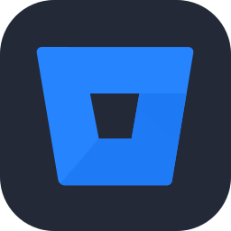</td>
    <td>blazor</td>
    <td></td>
    <td>blender</td>
    <td></td>
  </tr>
  <tr>
    <td>bootstrap</td>
    <td></td>
    <td>brave</td>
    <td></td>
    <td>breeze</td>
    <td></td>
    <td>bridge</td>
    <td></td>
  </tr>
  <tr>
    <td>bsd</td>
    <td></td>
    <td>bulma</td>
    <td></td>
    <td>bun</td>
    <td></td>
    <td>c</td>
    <td></td>
  </tr>
  <tr>
    <td>canva</td>
    <td></td>
    <td>capacitor</td>
    <td></td>
    <td>capture</td>
    <td></td>
    <td>cashier</td>
    <td></td>
  </tr>
  <tr>
    <td>cassandra</td>
    <td></td>
    <td>characteranimator</td>
    <td></td>
    <td>chatgpt</td>
    <td></td>
    <td>chrome</td>
    <td></td>
  </tr>
  <tr>
    <td>chromium</td>
    <td></td>
    <td>circleci</td>
    <td></td>
    <td>clion</td>
    <td></td>
    <td>clojure</td>
    <td></td>
  </tr>
  <tr>
    <td>cloudflare</td>
    <td></td>
    <td>cmake</td>
    <td></td>
    <td>codeberg</td>
    <td></td>
    <td>codeigniter</td>
    <td></td>
  </tr>
  <tr>
    <td>codepen</td>
    <td></td>
    <td>coffeescript</td>
    <td></td>
    <td>cpp</td>
    <td></td>
    <td>creativecloud</td>
    <td></td>
  </tr>
  <tr>
    <td>crystal</td>
    <td></td>
    <td>cs</td>
    <td></td>
    <td>css</td>
    <td></td>
    <td>cypress</td>
    <td></td>
  </tr>
  <tr>
    <td>d</td>
    <td></td>
    <td>d3</td>
    <td></td>
    <td>dailydev</td>
    <td></td>
    <td>dart</td>
    <td></td>
  </tr>
  <tr>
    <td>databricks</td>
    <td></td>
    <td>databricks-black</td>
    <td>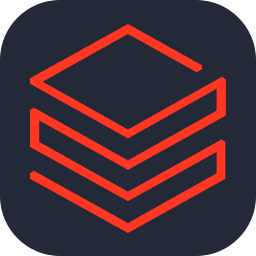</td>
    <td>datadog</td>
    <td></td>
    <td>datagrip</td>
    <td></td>
  </tr>
  <tr>
    <td>dataspell</td>
    <td></td>
    <td>dbeaver</td>
    <td></td>
    <td>debian</td>
    <td></td>
    <td>defold</td>
    <td></td>
  </tr>
  <tr>
    <td>deno</td>
    <td></td>
    <td>desmos</td>
    <td></td>
    <td>devto</td>
    <td></td>
    <td>digitalocean</td>
    <td></td>
  </tr>
  <tr>
    <td>dimension</td>
    <td></td>
    <td>directus</td>
    <td></td>
    <td>discord</td>
    <td></td>
    <td>discordbots</td>
    <td></td>
  </tr>
  <tr>
    <td>discordjs</td>
    <td></td>
    <td>django</td>
    <td></td>
    <td>docker</td>
    <td></td>
    <td>docksal</td>
    <td>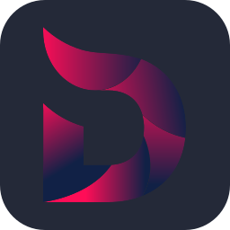</td>
  </tr>
  <tr>
    <td>dotnet</td>
    <td></td>
    <td>dreamweaver</td>
    <td></td>
    <td>drupal</td>
    <td></td>
    <td>duckduckgo</td>
    <td></td>
  </tr>
  <tr>
    <td>dusk</td>
    <td></td>
    <td>dynamodb</td>
    <td></td>
    <td>echo</td>
    <td></td>
    <td>eclipse</td>
    <td></td>
  </tr>
  <tr>
    <td>edge</td>
    <td></td>
    <td>elasticsearch</td>
    <td></td>
    <td>electron</td>
    <td></td>
    <td>elixir</td>
    <td></td>
  </tr>
  <tr>
    <td>elysia</td>
    <td></td>
    <td>emacs</td>
    <td></td>
    <td>ember</td>
    <td></td>
    <td>emotion</td>
    <td>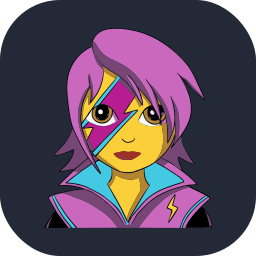</td>
  </tr>
  <tr>
    <td>envoyer</td>
    <td></td>
    <td>excel</td>
    <td>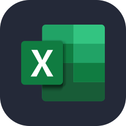</td>
    <td>expressjs</td>
    <td></td>
    <td>facebook</td>
    <td></td>
  </tr>
  <tr>
    <td>fastai</td>
    <td></td>
    <td>fastapi</td>
    <td></td>
    <td>fediverse</td>
    <td>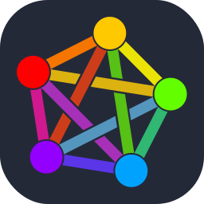</td>
    <td>figma</td>
    <td></td>
  </tr>
  <tr>
    <td>filament</td>
    <td></td>
    <td>firebase</td>
    <td></td>
    <td>firefox</td>
    <td></td>
    <td>flameshot</td>
    <td></td>
  </tr>
  <tr>
    <td>flask</td>
    <td></td>
    <td>fleet</td>
    <td></td>
    <td>flutter</td>
    <td></td>
    <td>fonts</td>
    <td></td>
  </tr>
  <tr>
    <td>forge</td>
    <td></td>
    <td>forth</td>
    <td></td>
    <td>fortran</td>
    <td></td>
    <td>fresco</td>
    <td></td>
  </tr>
  <tr>
    <td>fuse</td>
    <td></td>
    <td>gamemakerstudio</td>
    <td></td>
    <td>ganache</td>
    <td></td>
    <td>gatsby</td>
    <td></td>
  </tr>
  <tr>
    <td>gcp</td>
    <td></td>
    <td>gemini</td>
    <td></td>
    <td>gherkin</td>
    <td></td>
    <td>gimp</td>
    <td></td>
  </tr>
  <tr>
    <td>git</td>
    <td></td>
    <td>github</td>
    <td></td>
    <td>githubactions</td>
    <td></td>
    <td>githubcopilot</td>
    <td></td>
  </tr>
  <tr>
    <td>gitkraken</td>
    <td></td>
    <td>gitlab</td>
    <td></td>
    <td>gleam</td>
    <td></td>
    <td>gmail</td>
    <td></td>
  </tr>
  <tr>
    <td>gnome</td>
    <td></td>
    <td>godot</td>
    <td></td>
    <td>goland</td>
    <td></td>
    <td>golang</td>
    <td></td>
  </tr>
  <tr>
    <td>googleanalytics</td>
    <td></td>
    <td>googleappsscript</td>
    <td></td>
    <td>gradle</td>
    <td></td>
    <td>grafana</td>
    <td></td>
  </tr>
  <tr>
    <td>grails</td>
    <td></td>
    <td>graphql</td>
    <td></td>
    <td>grunt</td>
    <td></td>
    <td>gsap</td>
    <td></td>
  </tr>
  <tr>
    <td>gtk</td>
    <td></td>
    <td>gulp</td>
    <td></td>
    <td>hardhat</td>
    <td></td>
    <td>haskell</td>
    <td></td>
  </tr>
  <tr>
    <td>haxe</td>
    <td></td>
    <td>haxeflixel</td>
    <td>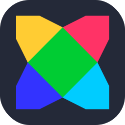</td>
    <td>helix</td>
    <td></td>
    <td>helm</td>
    <td></td>
  </tr>
  <tr>
    <td>herd</td>
    <td></td>
    <td>heroku</td>
    <td></td>
    <td>hibernate</td>
    <td></td>
    <td>holyc</td>
    <td></td>
  </tr>
  <tr>
    <td>hono</td>
    <td></td>
    <td>horizon</td>
    <td></td>
    <td>html</td>
    <td></td>
    <td>htmx</td>
    <td></td>
  </tr>
  <tr>
    <td>htop</td>
    <td></td>
    <td>hydrogen</td>
    <td></td>
    <td>hyprland</td>
    <td></td>
    <td>i3</td>
    <td></td>
  </tr>
  <tr>
    <td>idea</td>
    <td></td>
    <td>ignite</td>
    <td></td>
    <td>illustrator</td>
    <td></td>
    <td>incopy</td>
    <td></td>
  </tr>
  <tr>
    <td>indesign</td>
    <td></td>
    <td>inertia</td>
    <td></td>
    <td>infura</td>
    <td></td>
    <td>insomnia</td>
    <td></td>
  </tr>
  <tr>
    <td>instagram</td>
    <td></td>
    <td>ipfs</td>
    <td></td>
    <td>java</td>
    <td></td>
    <td>javascript</td>
    <td></td>
  </tr>
  <tr>
    <td>jenkins</td>
    <td></td>
    <td>jest</td>
    <td></td>
    <td>jetpackcompose</td>
    <td></td>
    <td>jetstream</td>
    <td></td>
  </tr>
  <tr>
    <td>jira</td>
    <td></td>
    <td>joomla</td>
    <td></td>
    <td>jquery</td>
    <td></td>
    <td>julia</td>
    <td></td>
  </tr>
  <tr>
    <td>kafka</td>
    <td></td>
    <td>kaggle</td>
    <td>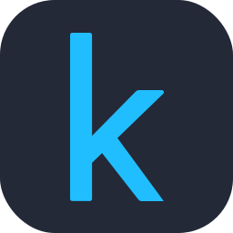</td>
    <td>kakoune</td>
    <td></td>
    <td>kali</td>
    <td></td>
  </tr>
  <tr>
    <td>kde</td>
    <td></td>
    <td>keycloak</td>
    <td></td>
    <td>kotlin</td>
    <td></td>
    <td>ktor</td>
    <td>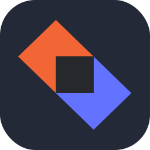</td>
  </tr>
  <tr>
    <td>kubernetes</td>
    <td></td>
    <td>langchain</td>
    <td></td>
    <td>laravel</td>
    <td></td>
    <td>laravelspark</td>
    <td></td>
  </tr>
  <tr>
    <td>latex</td>
    <td></td>
    <td>leetcode</td>
    <td></td>
    <td>less</td>
    <td></td>
    <td>lightning</td>
    <td></td>
  </tr>
  <tr>
    <td>lightroom</td>
    <td></td>
    <td>lightroomclassic</td>
    <td></td>
    <td>linkedin</td>
    <td></td>
    <td>linux</td>
    <td></td>
  </tr>
  <tr>
    <td>lit</td>
    <td></td>
    <td>litmus</td>
    <td></td>
    <td>livewire</td>
    <td></td>
    <td>looker</td>
    <td></td>
  </tr>
  <tr>
    <td>lua</td>
    <td></td>
    <td>lucidchart</td>
    <td></td>
    <td>manjaro</td>
    <td></td>
    <td>markdown</td>
    <td></td>
  </tr>
  <tr>
    <td>mastodon</td>
    <td></td>
    <td>materialui</td>
    <td></td>
    <td>matlab</td>
    <td></td>
    <td>matplotlib</td>
    <td></td>
  </tr>
  <tr>
    <td>maven</td>
    <td></td>
    <td>mediaencoder</td>
    <td></td>
    <td>mermaid</td>
    <td></td>
    <td>meteorjs</td>
    <td></td>
  </tr>
  <tr>
    <td>microsoftcopilot</td>
    <td></td>
    <td>millionjs</td>
    <td></td>
    <td>mint</td>
    <td></td>
    <td>miro</td>
    <td></td>
  </tr>
  <tr>
    <td>misskey</td>
    <td></td>
    <td>mjml</td>
    <td>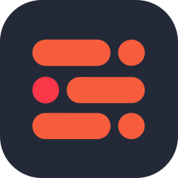</td>
    <td>ml5</td>
    <td></td>
    <td>mojo</td>
    <td></td>
  </tr>
  <tr>
    <td>mongodb</td>
    <td></td>
    <td>mysql</td>
    <td></td>
    <td>neovim</td>
    <td></td>
    <td>nestjs</td>
    <td></td>
  </tr>
  <tr>
    <td>netlify</td>
    <td></td>
    <td>nextjs</td>
    <td>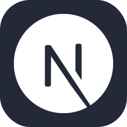</td>
    <td>nginx</td>
    <td></td>
    <td>ngrok</td>
    <td></td>
  </tr>
  <tr>
    <td>nim</td>
    <td></td>
    <td>nixos</td>
    <td>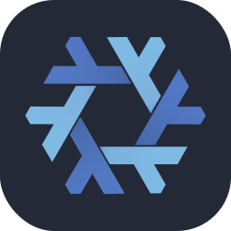</td>
    <td>nodejs</td>
    <td></td>
    <td>notion</td>
    <td></td>
  </tr>
  <tr>
    <td>nova</td>
    <td></td>
    <td>npm</td>
    <td></td>
    <td>numpy</td>
    <td></td>
    <td>nuxtjs</td>
    <td></td>
  </tr>
  <tr>
    <td>obsidian</td>
    <td></td>
    <td>ocaml</td>
    <td></td>
    <td>octane</td>
    <td></td>
    <td>octave</td>
    <td>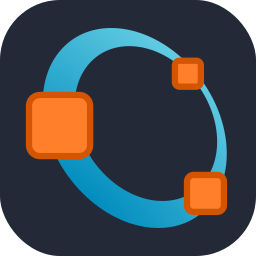</td>
  </tr>
  <tr>
    <td>ollama</td>
    <td></td>
    <td>onedrive</td>
    <td></td>
    <td>onenote</td>
    <td></td>
    <td>opencv</td>
    <td></td>
  </tr>
  <tr>
    <td>openshift</td>
    <td></td>
    <td>openstack</td>
    <td>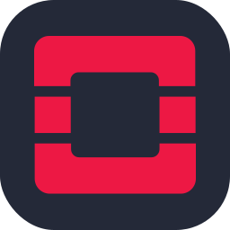</td>
    <td>openzeppelin</td>
    <td></td>
    <td>opera</td>
    <td></td>
  </tr>
  <tr>
    <td>oracle</td>
    <td></td>
    <td>outlook</td>
    <td></td>
    <td>p5js</td>
    <td></td>
    <td>pail</td>
    <td></td>
  </tr>
  <tr>
    <td>pandas</td>
    <td></td>
    <td>papertrail</td>
    <td></td>
    <td>payload</td>
    <td></td>
    <td>pbi</td>
    <td></td>
  </tr>
  <tr>
    <td>pennant</td>
    <td></td>
    <td>perl</td>
    <td></td>
    <td>photoshop</td>
    <td></td>
    <td>photoshopclassic</td>
    <td></td>
  </tr>
  <tr>
    <td>photoshopexpress</td>
    <td></td>
    <td>php</td>
    <td></td>
    <td>phpstorm</td>
    <td></td>
    <td>picocss</td>
    <td></td>
  </tr>
  <tr>
    <td>pinecone</td>
    <td></td>
    <td>pinia</td>
    <td></td>
    <td>pint</td>
    <td></td>
    <td>pkl</td>
    <td></td>
  </tr>
  <tr>
    <td>plan9</td>
    <td></td>
    <td>planetscale</td>
    <td></td>
    <td>playwright</td>
    <td></td>
    <td>pnpm</td>
    <td></td>
  </tr>
  <tr>
    <td>pocketbase</td>
    <td></td>
    <td>popos</td>
    <td></td>
    <td>portfolio</td>
    <td></td>
    <td>postgresql</td>
    <td></td>
  </tr>
  <tr>
    <td>postman</td>
    <td></td>
    <td>powerpoint</td>
    <td></td>
    <td>powershell</td>
    <td></td>
    <td>preact</td>
    <td></td>
  </tr>
  <tr>
    <td>prelude</td>
    <td></td>
    <td>premiere</td>
    <td></td>
    <td>premiererush</td>
    <td></td>
    <td>prisma</td>
    <td></td>
  </tr>
  <tr>
    <td>processing</td>
    <td></td>
    <td>prometheus</td>
    <td></td>
    <td>prompts</td>
    <td></td>
    <td>proton</td>
    <td></td>
  </tr>
  <tr>
    <td>proxmox</td>
    <td></td>
    <td>pug</td>
    <td></td>
    <td>pulse</td>
    <td></td>
    <td>puppeteer</td>
    <td></td>
  </tr>
  <tr>
    <td>pycharm</td>
    <td></td>
    <td>python</td>
    <td></td>
    <td>pytorch</td>
    <td></td>
    <td>pyxel</td>
    <td></td>
  </tr>
  <tr>
    <td>qodana</td>
    <td></td>
    <td>qt</td>
    <td></td>
    <td>r</td>
    <td></td>
    <td>rabbitmq</td>
    <td></td>
  </tr>
  <tr>
    <td>rails</td>
    <td></td>
    <td>raspberrypi</td>
    <td></td>
    <td>react</td>
    <td></td>
    <td>reactivex</td>
    <td></td>
  </tr>
  <tr>
    <td>reactquery</td>
    <td>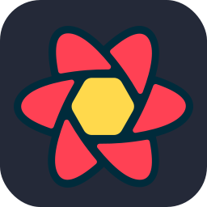</td>
    <td>recoil</td>
    <td></td>
    <td>redhat</td>
    <td></td>
    <td>redis</td>
    <td></td>
  </tr>
  <tr>
    <td>redshift</td>
    <td></td>
    <td>redux</td>
    <td></td>
    <td>regex</td>
    <td></td>
    <td>remix</td>
    <td></td>
  </tr>
  <tr>
    <td>replit</td>
    <td>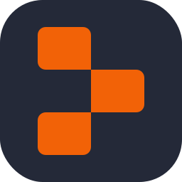</td>
    <td>resharper</td>
    <td></td>
    <td>reverb</td>
    <td></td>
    <td>rider</td>
    <td></td>
  </tr>
  <tr>
    <td>robloxstudio</td>
    <td></td>
    <td>rocket</td>
    <td></td>
    <td>rollupjs</td>
    <td></td>
    <td>ros</td>
    <td></td>
  </tr>
  <tr>
    <td>rubocop</td>
    <td>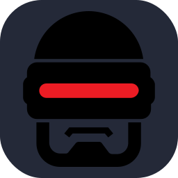</td>
    <td>ruby</td>
    <td></td>
    <td>rubymine</td>
    <td></td>
    <td>rust</td>
    <td></td>
  </tr>
  <tr>
    <td>rustrover</td>
    <td></td>
    <td>safari</td>
    <td></td>
    <td>sail</td>
    <td></td>
    <td>sanctum</td>
    <td></td>
  </tr>
  <tr>
    <td>sass</td>
    <td></td>
    <td>scala</td>
    <td></td>
    <td>scikitlearn</td>
    <td></td>
    <td>scipy</td>
    <td></td>
  </tr>
  <tr>
    <td>scout</td>
    <td></td>
    <td>scratch</td>
    <td></td>
    <td>seaborn</td>
    <td></td>
    <td>selenium</td>
    <td></td>
  </tr>
  <tr>
    <td>sentry</td>
    <td></td>
    <td>sequelize</td>
    <td></td>
    <td>sharepoint</td>
    <td></td>
    <td>shopify</td>
    <td></td>
  </tr>
  <tr>
    <td>skeletonui</td>
    <td></td>
    <td>sketchup</td>
    <td></td>
    <td>slack</td>
    <td></td>
    <td>snowflake</td>
    <td></td>
  </tr>
  <tr>
    <td>snyk</td>
    <td></td>
    <td>socialite</td>
    <td></td>
    <td>solidity</td>
    <td></td>
    <td>solidjs</td>
    <td></td>
  </tr>
  <tr>
    <td>spark</td>
    <td></td>
    <td>spring</td>
    <td></td>
    <td>sqlite</td>
    <td></td>
    <td>sqlserver</td>
    <td></td>
  </tr>
  <tr>
    <td>stackoverflow</td>
    <td></td>
    <td>stock</td>
    <td></td>
    <td>storyblok</td>
    <td></td>
    <td>storybook</td>
    <td></td>
  </tr>
  <tr>
    <td>strapi</td>
    <td></td>
    <td>streamlit</td>
    <td></td>
    <td>styledcomponents</td>
    <td></td>
    <td>sublime</td>
    <td>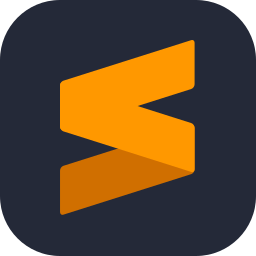</td>
  </tr>
  <tr>
    <td>supabase</td>
    <td></td>
    <td>surrealdb</td>
    <td></td>
    <td>svelte</td>
    <td></td>
    <td>svg</td>
    <td></td>
  </tr>
  <tr>
    <td>svn</td>
    <td></td>
    <td>swagger</td>
    <td></td>
    <td>swift</td>
    <td></td>
    <td>symfony</td>
    <td></td>
  </tr>
  <tr>
    <td>tableau</td>
    <td></td>
    <td>tailwindcss</td>
    <td></td>
    <td>tallyprime</td>
    <td>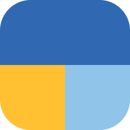</td>
    <td>tauri</td>
    <td></td>
  </tr>
  <tr>
    <td>teams</td>
    <td></td>
    <td>telescope</td>
    <td></td>
    <td>tensorflow</td>
    <td></td>
    <td>terraform</td>
    <td></td>
  </tr>
  <tr>
    <td>testinglibrary</td>
    <td></td>
    <td>threejs</td>
    <td></td>
    <td>tor</td>
    <td></td>
    <td>trpc</td>
    <td></td>
  </tr>
  <tr>
    <td>truffle</td>
    <td></td>
    <td>typescript</td>
    <td></td>
    <td>ubuntu</td>
    <td></td>
    <td>unity</td>
    <td></td>
  </tr>
  <tr>
    <td>unrealengine</td>
    <td></td>
    <td>v</td>
    <td></td>
    <td>vala</td>
    <td></td>
    <td>vapor</td>
    <td>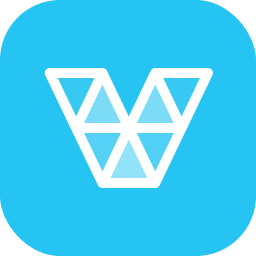</td>
  </tr>
  <tr>
    <td>vercel</td>
    <td></td>
    <td>vim</td>
    <td></td>
    <td>visualbasic</td>
    <td></td>
    <td>visualstudio</td>
    <td></td>
  </tr>
  <tr>
    <td>vite</td>
    <td>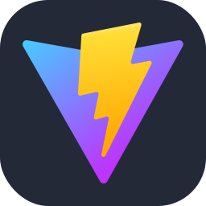</td>
    <td>vitest</td>
    <td></td>
    <td>vscode</td>
    <td></td>
    <td>vscodium</td>
    <td></td>
  </tr>
  <tr>
    <td>vuejs</td>
    <td></td>
    <td>vuetify</td>
    <td></td>
    <td>vyper</td>
    <td></td>
    <td>webassembly</td>
    <td></td>
  </tr>
  <tr>
    <td>webflow</td>
    <td></td>
    <td>webpack</td>
    <td></td>
    <td>webstorm</td>
    <td></td>
    <td>windicss</td>
    <td></td>
  </tr>
  <tr>
    <td>windows</td>
    <td></td>
    <td>word</td>
    <td></td>
    <td>wordpress</td>
    <td></td>
    <td>workers</td>
    <td></td>
  </tr>
  <tr>
    <td>x</td>
    <td></td>
    <td>xcode</td>
    <td></td>
    <td>xd</td>
    <td></td>
    <td>yaml</td>
    <td></td>
  </tr>
  <tr>
    <td>yammer</td>
    <td></td>
    <td>yarn</td>
    <td></td>
    <td>yew</td>
    <td>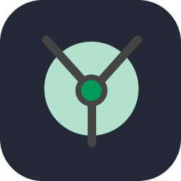</td>
    <td>youtube</td>
    <td></td>
  </tr>
  <tr>
    <td>zed</td>
    <td></td>
    <td>zig</td>
    <td></td>
  </tr>
</table>

<!-- END ICONS LIST -->
---

## 💖 Support the Project

Thank you so much already for using my projects!

To support the project directly, feel free to open issues for icon suggestions, or contribute with a pull request!
