<p align="center"></p>
<p align="center"></p>
<h3 align="center">Showcase your skills on your GitHub or resumé with ease!</h3>
<hr>

# Docs

- [Docs](#docs)
- [Example](#example)
- [Specifying Icons](#specifying-icons)
- [Themed Icons](#themed-icons)
- [Icons Per Line](#icons-per-line)
- [Get Icons Names](#get-icons-names)
- [Centering Icons](#centering-icons)
- [Icons List](#icons-list)
  - [💖 Support the Project](#-support-the-project)

# Example

<p align="center"></p>
<p align="center"></p>

# Specifying Icons

Copy and paste the code block below into your readme to add the skills icon element!

Change the `?i=js,html,css` to a list of your skills separated by ","s! You can find a full list of icons [here](#icons-list).

```md

```


# Themed Icons

Some icons have a dark and light themed background. You can specify which theme you want as a url parameter.

This is optional. The default theme is dark.

Change the `&theme=light` to either `dark` or `light`. The theme is the background color, so light theme has a white icon background, and dark has a black-ish.

**Light Theme Example:**

```md

```


# Icons Per Line

You can specify how many icons you would like per line! It's an optional argument, and the default is 15.

Change the `&perline=3` to any number between 1 and 50.

```md

```


# Get Icons Names

You can get the possiblity to add the name of the icons you put to help others that doesnt know what they are by using `&titles`.

The value of `titles` is a boolean, so it should be `true` or `false`, default is `false`

```md

```


# Centering Icons

Want to center the icons in your readme? The SVGs are automatically resized, so you can do it the same way you'd normally center an image.

```html
<p align="center">
  <a href="https://go-skill-icons.vercel.app/">
    
  </a>
</p>
```

<p align="center">
  <a href="https://go-skill-icons.vercel.app/">
    
  </a>
</p>

# Icons List

Here's a list of all the icons currently supported. Feel free to open an issue to suggest icons to add!

<!-- START ICONS LIST -->
| Icon ID              | Dark Icon            | Icon ID              | Light Icon           | Icon ID              | Neutral Icon         |
| -------------------- | -------------------- | -------------------- | -------------------- | -------------------- | -------------------- |
| ableton              |  | ableton              |  | ableton-auto         |  |
| activitypub          |  | activitypub          |  | acrobat              |  |
| actix                |  | actix                |  | activitypub-auto     |  |
| aiscript             |  | aiscript             |  | actix-auto           |  |
| alchemy              |  | alchemy              |  | adonis               |  |
| alpinejs             |  | alpinejs             |  | aero                 |  |
| anaconda             |  | anaconda             |  | aftereffects         |  |
| androidstudio        |  | androidstudio        |  | aiscript-auto        |  |
| angular              |  | angular              |  | alchemy-auto         |  |
| anss                 |  | anss                 |  | alpinejs-auto        |  |
| appcode              |  | appcode              |  | anaconda-auto        |  |
| apple                |  | apple                |  | androidstudio-auto   |  |
| aqua                 |  | aqua                 |  | angular-auto         |  |
| arch                 |  | arch                 |  | animate              |  |
| argocd               |  | argocd               |  | ansible              |  |
| autocad              |  | autocad              |  | anss-auto            |  |
| aws                  |  | aws                  |  | apollo               |  |
| azure                |  | azure                |  | appcode-auto         |  |
| bash                 |  | bash                 |  | apple-auto           |  |
| beeceptor            |  | beeceptor            |  | appwrite             |  |
| bevy                 |  | bevy                 |  | aqua-auto            |  |
| bitbucket            |  | bitbucket            |  | arch-auto            |  |
| blazor               |  | blazor               |  | arduino              |  |
| blender              |  | blender              |  | argocd-auto          |  |
| brave                |  | brave                |  | assembly             |  |
| bsd                  |  | bsd                  |  | astro                |  |
| bulma                |  | bulma                | 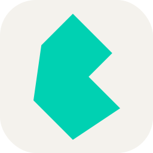 | atom                 |  |
| bun                  |  | bun                  |  | audition             |  |
| canva                |  | canva                |  | autocad-auto         |  |
| capacitor            |  | capacitor            |  | aws-auto             |  |
| cassandra            |  | cassandra            |  | azul                 |  |
| chatgpt              |  | chatgpt              |  | azure-auto           | 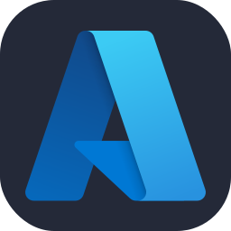 |
| chrome               |  | chrome               |  | babel                |  |
| chromium             |  | chromium             |  | bash-auto            |  |
| circleci             |  | circleci             |  | beeceptor-auto       |  |
| clion                |  | clion                |  | behance              |  |
| clojure              |  | clojure              |  | bevy-auto            | 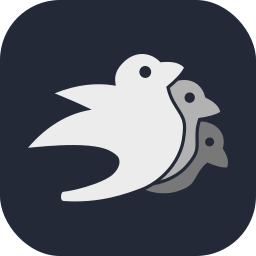 |
| cloudflare           |  | cloudflare           |  | bitbucket-auto       |  |
| cmake                |  | cmake                |  | blazor-auto          |  |
| codeberg             |  | codeberg             |  | blender-auto         | 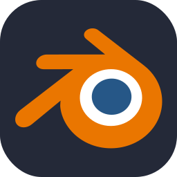 |
| codeigniter          |  | codeigniter          |  | bootstrap            |  |
| codepen              |  | codepen              |  | brave-auto           |  |
| coffeescript         |  | coffeescript         |  | breeze               |  |
| crystal              |  | crystal              |  | bridge               |  |
| cypress              |  | cypress              |  | bsd-auto             |  |
| d3                   |  | d3                   |  | bulma-auto           |  |
| dailydev             |  | dailydev             |  | bun-auto             |  |
| dart                 |  | dart                 |  | c                    |  |
| datagrip             |  | databricks           |  | canva-auto           |  |
| dataspell            |  | datagrip             |  | capacitor-auto       |  |
| dbeaver              |  | dataspell            |  | capture              |  |
| defold               |  | dbeaver              |  | cashier              |  |
| deno                 |  | defold               |  | cassandra-auto       |  |
| devto                |  | deno                 |  | characteranimator    |  |
| digitalocean         |  | devto                |  | chatgpt-auto         |  |
| discordjs            |  | digitalocean         |  | chrome-auto          |  |
| docksal              |  | discordjs            |  | chromium-auto        |  |
| drupal               |  | docksal              |  | circleci-auto        |  |
| dynamodb             |  | drupal               |  | clion-auto           |  |
| eclipse              |  | dynamodb             |  | clojure-auto         |  |
| edge                 |  | eclipse              |  | cloudflare-auto      |  |
| elasticsearch        |  | edge                 |  | cmake-auto           |  |
| elixir               |  | elasticsearch        |  | codeberg-auto        |  |
| elysia               |  | elixir               |  | codeigniter-auto     |  |
| emotion              |  | elysia               |  | codepen-auto         |  |
| excel                |  | emotion              |  | coffeescript-auto    |  |
| expressjs            |  | excel                |  | cpp                  |  |
| fastai               |  | expressjs            |  | creativecloud        |  |
| fediverse            |  | fastai               |  | crystal-auto         |  |
| figma                |  | fediverse            |  | cs                   |  |
| firebase             |  | figma                |  | css                  |  |
| firefox              |  | firebase             |  | cypress-auto         |  |
| flask                |  | firefox              |  | d                    |  |
| fleet                |  | flask                |  | d3-auto              |  |
| flutter              |  | fleet                |  | dailydev-auto        |  |
| ganache              |  | flutter              |  | dart-auto            |  |
| gcp                  |  | ganache              |  | databricks-auto      |  |
| gemini               |  | gcp                  |  | databricks-black     |  |
| gherkin              |  | gemini               |  | datadog              |  |
| gimp                 |  | gherkin              |  | datagrip-auto        |  |
| git                  |  | gimp                 |  | dataspell-auto       |  |
| github               |  | git                  |  | dbeaver-auto         |  |
| githubactions        |  | github               |  | debian               |  |
| githubcopilot        |  | githubactions        |  | defold-auto          | 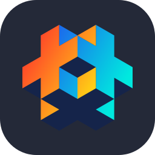 |
| gitkraken            |  | githubcopilot        |  | deno-auto            |  |
| gitlab               |  | gitkraken            |  | desmos               |  |
| gleam                |  | gitlab               |  | devto-auto           |  |
| gmail                |  | gleam                |  | dimension            |  |
| gnome                |  | gmail                |  | directus             |  |
| godot                |  | gnome                |  | discord              |  |
| goland               |  | godot                |  | discordbots          |  |
| googleanalytics      |  | goland               |  | discordjs-auto       |  |
| googleappsscript     |  | googleanalytics      |  | django               |  |
| gradle               |  | googleappsscript     |  | docker               |  |
| grafana              |  | gradle               |  | docksal-auto         |  |
| graphql              |  | grafana              |  | dotnet               |  |
| grunt                |  | graphql              |  | dreamweaver          |  |
| gsap                 |  | grunt                |  | drupal-auto          | 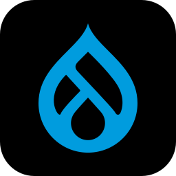 |
| gtk                  |  | gsap                 |  | duckduckgo           |  |
| hardhat              |  | gtk                  |  | dusk                 |  |
| haskell              |  | hardhat              |  | dynamodb-auto        |  |
| haxe                 |  | haskell              |  | echo                 |  |
| haxeflixel           |  | haxe                 |  | eclipse-auto         | 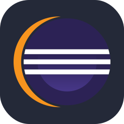 |
| helix                |  | haxeflixel           |  | edge-auto            |  |
| helm                 |  | helix                |  | elasticsearch-auto   |  |
| hibernate            |  | helm                 |  | electron             |  |
| hono                 |  | hibernate            |  | elixir-auto          |  |
| htmx                 |  | hono                 |  | elysia-auto          |  |
| htop                 |  | htmx                 |  | emacs                |  |
| hydrogen             |  | htop                 |  | ember                |  |
| hyprland             |  | hydrogen             |  | emotion-auto         |  |
| i3                   |  | hyprland             |  | envoyer              |  |
| idea                 |  | i3                   |  | excel-auto           |  |
| ignite               |  | idea                 |  | expressjs-auto       |  |
| ipfs                 |  | ignite               |  | facebook             |  |
| java                 |  | ipfs                 |  | fastai-auto          |  |
| jenkins              |  | java                 |  | fastapi              |  |
| jetpackcompose       |  | jenkins              |  | fediverse-auto       |  |
| jira                 |  | jetpackcompose       |  | figma-auto           |  |
| joomla               |  | jira                 |  | filament             |  |
| julia                |  | joomla               |  | firebase-auto        |  |
| kaggle               |  | julia                |  | firefox-auto         |  |
| kakoune              |  | kaggle               |  | flameshot            |  |
| kali                 |  | kakoune              |  | flask-auto           |  |
| kde                  |  | kali                 |  | fleet-auto           |  |
| kotlin               |  | kde                  |  | flutter-auto         |  |
| ktor                 |  | kotlin               |  | fonts                |  |
| langchain            |  | ktor                 |  | forge                |  |
| laravel              |  | langchain            |  | forth                |  |
| laravelspark         |  | laravel              |  | fortran              |  |
| latex                |  | laravelspark         |  | fresco               |  |
| leetcode             |  | latex                |  | fuse                 |  |
| less                 |  | leetcode             |  | gamemakerstudio      |  |
| lightning            |  | less                 |  | ganache-auto         |  |
| linux                |  | lightning            |  | gatsby               |  |
| lit                  |  | linux                |  | gcp-auto             |  |
| litmus               |  | lit                  |  | gemini-auto          |  |
| livewire             |  | litmus               |  | gherkin-auto         |  |
| looker               |  | livewire             |  | gimp-auto            |  |
| lua                  |  | looker               |  | git-auto             |  |
| lucidchart           |  | lua                  |  | github-auto          |  |
| markdown             |  | lucidchart           |  | githubactions-auto   |  |
| mastodon             |  | markdown             |  | githubcopilot-auto   |  |
| materialui           |  | mastodon             |  | gitkraken-auto       |  |
| matlab               |  | materialui           |  | gitlab-auto          |  |
| matplotlib           |  | matlab               |  | gleam-auto           |  |
| maven                |  | matplotlib           |  | gmail-auto           |  |
| meteorjs             |  | maven                |  | gnome-auto           |  |
| microsoftcopilot     |  | meteorjs             |  | godot-auto           |  |
| millionjs            |  | microsoftcopilot     |  | goland-auto          |  |
| mint                 |  | millionjs            |  | golang               |  |
| misskey              |  | mint                 |  | googleanalytics-auto |  |
| mjml                 |  | misskey              |  | googleappsscript-auto |  |
| ml5                  |  | mjml                 |  | gradle-auto          |  |
| mojo                 |  | ml5                  |  | grafana-auto         |  |
| mysql                |  | mojo                 |  | grails               |  |
| neovim               |  | mysql                |  | graphql-auto         |  |
| nestjs               |  | neovim               |  | grunt-auto           |  |
| netlify              |  | nestjs               |  | gsap-auto            |  |
| nextjs               |  | netlify              |  | gtk-auto             |  |
| nim                  |  | nextjs               |  | gulp                 |  |
| nixos                |  | nim                  |  | hardhat-auto         |  |
| nodejs               |  | nixos                |  | haskell-auto         |  |
| notion               |  | nodejs               |  | haxe-auto            |  |
| npm                  |  | notion               |  | haxeflixel-auto      |  |
| numpy                |  | npm                  |  | helix-auto           |  |
| nuxtjs               |  | numpy                |  | helm-auto            |  |
| obsidian             |  | nuxtjs               |  | herd                 |  |
| octave               |  | obsidian             |  | heroku               |  |
| ollama               |  | octave               |  | hibernate-auto       |  |
| onedrive             |  | ollama               |  | holyc                |  |
| onenote              |  | onedrive             |  | hono-auto            |  |
| opencv               |  | onenote              |  | horizon              |  |
| openstack            |  | opencv               |  | html                 |  |
| openzeppelin         |  | openstack            |  | htmx-auto            |  |
| opera                |  | openzeppelin         |  | htop-auto            |  |
| oracle               |  | opera                |  | hydrogen-auto        |  |
| outlook              |  | oracle               |  | hyprland-auto        |  |
| pail                 |  | outlook              |  | i3-auto              | 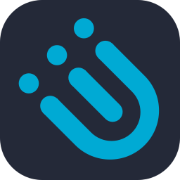 |
| pandas               |  | pail                 |  | idea-auto            |  |
| payload              |  | pandas               |  | ignite-auto          |  |
| pbi                  |  | payload              |  | illustrator          |  |
| php                  |  | pbi                  |  | incopy               |  |
| phpstorm             |  | php                  |  | indesign             |  |
| picocss              |  | phpstorm             |  | inertia              |  |
| pinecone             |  | picocss              |  | infura               |  |
| pinia                |  | pinecone             |  | insomnia             |  |
| pkl                  |  | pinia                |  | instagram            |  |
| plan9                |  | pkl                  |  | ipfs-auto            |  |
| planetscale          |  | plan9                |  | java-auto            |  |
| playwright           |  | planetscale          |  | javascript           |  |
| pnpm                 |  | playwright           |  | jenkins-auto         |  |
| pocketbase           |  | pnpm                 |  | jest                 |  |
| postgresql           |  | pocketbase           |  | jetpackcompose-auto  |  |
| powerpoint           |  | postgresql           |  | jetstream            |  |
| powershell           |  | powerpoint           |  | jira-auto            |  |
| preact               |  | powershell           |  | joomla-auto          |  |
| processing           |  | preact               |  | jquery               |  |
| proton               |  | processing           |  | julia-auto           |  |
| proxmox              |  | proton               |  | kafka                |  |
| pug                  |  | proxmox              |  | kaggle-auto          |  |
| pulse                |  | pug                  |  | kakoune-auto         |  |
| puppeteer            |  | pulse                |  | kali-auto            |  |
| pycharm              |  | puppeteer            |  | kde-auto             |  |
| python               |  | pycharm              |  | keycloak             |  |
| pytorch              |  | python               |  | kotlin-auto          |  |
| pyxel                |  | pytorch              |  | ktor-auto            |  |
| qodana               |  | pyxel                |  | kubernetes           |  |
| qt                   |  | qodana               |  | langchain-auto       |  |
| r                    |  | qt                   |  | laravel-auto         |  |
| rabbitmq             |  | r                    |  | laravelspark-auto    |  |
| raspberrypi          |  | rabbitmq             |  | latex-auto           |  |
| react                |  | raspberrypi          |  | leetcode-auto        |  |
| reactivex            |  | react                |  | less-auto            |  |
| reactquery           |  | reactivex            |  | lightning-auto       |  |
| redhat               |  | reactquery           |  | lightroom            |  |
| redis                |  | redhat               |  | lightroomclassic     |  |
| redshift             |  | redis                |  | linkedin             |  |
| regex                |  | redshift             |  | linux-auto           |  |
| remix                |  | regex                |  | lit-auto             |  |
| replit               |  | remix                |  | litmus-auto          |  |
| resharper            |  | replit               |  | livewire-auto        |  |
| rider                |  | resharper            |  | looker-auto          |  |
| rollupjs             |  | rider                |  | lua-auto             |  |
| ros                  |  | rollupjs             |  | lucidchart-auto      |  |
| rubocop              |  | ros                  |  | manjaro              | 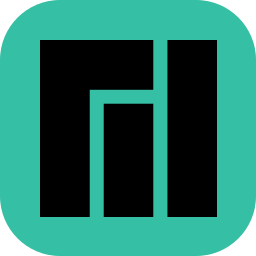 |
| rubymine             |  | rubocop              |  | markdown-auto        |  |
| rust                 |  | rubymine             |  | mastodon-auto        |  |
| rustrover            |  | rust                 |  | materialui-auto      |  |
| safari               |  | rustrover            |  | matlab-auto          |  |
| scala                |  | safari               |  | matplotlib-auto      |  |
| scikitlearn          |  | scala                |  | maven-auto           |  |
| scipy                |  | scikitlearn          |  | mediaencoder         |  |
| seaborn              |  | scipy                |  | mermaid              |  |
| sequelize            |  | seaborn              |  | meteorjs-auto        |  |
| sharepoint           |  | sequelize            |  | microsoftcopilot-auto |  |
| shopify              |  | sharepoint           |  | millionjs-auto       |  |
| skeletonui           |  | shopify              |  | mint-auto            |  |
| sketchup             |  | skeletonui           |  | miro                 |  |
| slack                |  | sketchup             |  | misskey-auto         |  |
| snowflake            |  | slack                |  | mjml-auto            |  |
| snyk                 |  | snowflake            |  | ml5-auto             |  |
| solidjs              |  | snyk                 |  | mojo-auto            |  |
| spring               |  | solidjs              |  | mongodb              |  |
| sqlserver            |  | spring               |  | mysql-auto           |  |
| stackoverflow        |  | sqlserver            |  | neovim-auto          |  |
| storyblok            |  | stackoverflow        |  | nestjs-auto          |  |
| storybook            |  | storyblok            |  | netlify-auto         |  |
| streamlit            |  | storybook            |  | nextjs-auto          |  |
| sublime              |  | streamlit            |  | nginx                |  |
| supabase             |  | sublime              |  | ngrok                |  |
| surrealdb            |  | supabase             |  | nim-auto             |  |
| svg                  |  | surrealdb            |  | nixos-auto           |  |
| swagger              |  | svg                  |  | nodejs-auto          |  |
| symfony              |  | swagger              |  | notion-auto          |  |
| tableau              |  | symfony              |  | nova                 |  |
| tailwindcss          |  | tableau              |  | npm-auto             | 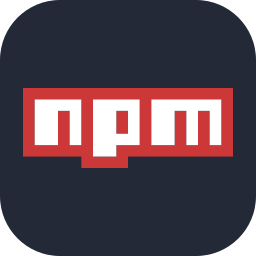 |
| tauri                |  | tailwindcss          |  | numpy-auto           |  |
| teams                |  | tauri                |  | nuxtjs-auto          |  |
| tensorflow           |  | teams                |  | obsidian-auto        |  |
| terraform            |  | tensorflow           |  | ocaml                |  |
| testinglibrary       |  | terraform            |  | octane               |  |
| threejs              |  | testinglibrary       |  | octave-auto          |  |
| tor                  |  | threejs              |  | ollama-auto          |  |
| truffle              |  | tor                  |  | onedrive-auto        |  |
| unity                |  | truffle              |  | onenote-auto         |  |
| v                    |  | unity                |  | opencv-auto          | 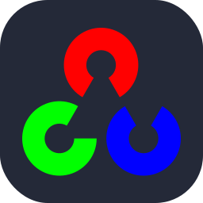 |
| vercel               |  | v                    |  | openshift            |  |
| vim                  |  | vercel               |  | openstack-auto       |  |
| visualbasic          |  | vim                  |  | openzeppelin-auto    |  |
| visualstudio         |  | visualbasic          |  | opera-auto           |  |
| vite                 |  | visualstudio         |  | oracle-auto          |  |
| vitest               |  | vite                 |  | outlook-auto         |  |
| vscode               |  | vitest               |  | p5js                 |  |
| vscodium             |  | vscode               |  | pail-auto            |  |
| vuejs                |  | vscodium             |  | pandas-auto          |  |
| vuetify              |  | vuejs                |  | papertrail           |  |
| vyper                |  | vuetify              |  | payload-auto         |  |
| webpack              |  | vyper                |  | pbi-auto             |  |
| webstorm             |  | webpack              |  | pennant              |  |
| windicss             |  | webstorm             |  | perl                 |  |
| windows              |  | windicss             |  | photoshop            |  |
| word                 |  | windows              |  | photoshopclassic     |  |
| workers              |  | word                 |  | photoshopexpress     |  |
| x                    |  | workers              |  | php-auto             |  |
| xcode                |  | x                    |  | phpstorm-auto        |  |
| yaml                 |  | xcode                |  | picocss-auto         |  |
| yammer               |  | yaml                 |  | pinecone-auto        |  |
| yarn                 |  | yammer               |  | pinia-auto           |  |
| yew                  |  | yarn                 |  | pint                 |  |
| zed                  |  | yew                  |  | pkl-auto             |  |
| zig                  |  | zed                  |  | plan9-auto           |  |
|                      |                      | zig                  |  | planetscale-auto     |  |
|                      |                      |                      |                      | playwright-auto      |  |
|                      |                      |                      |                      | pnpm-auto            |  |
|                      |                      |                      |                      | pocketbase-auto      |  |
|                      |                      |                      |                      | popos                |  |
|                      |                      |                      |                      | portfolio            |  |
|                      |                      |                      |                      | postgresql-auto      |  |
|                      |                      |                      |                      | postman              |  |
|                      |                      |                      |                      | powerpoint-auto      |  |
|                      |                      |                      |                      | powershell-auto      |  |
|                      |                      |                      |                      | preact-auto          |  |
|                      |                      |                      |                      | prelude              |  |
|                      |                      |                      |                      | premiere             |  |
|                      |                      |                      |                      | premiererush         |  |
|                      |                      |                      |                      | prisma               |  |
|                      |                      |                      |                      | processing-auto      |  |
|                      |                      |                      |                      | prometheus           |  |
|                      |                      |                      |                      | prompts              |  |
|                      |                      |                      |                      | proton-auto          |  |
|                      |                      |                      |                      | proxmox-auto         |  |
|                      |                      |                      |                      | pug-auto             |  |
|                      |                      |                      |                      | pulse-auto           |  |
|                      |                      |                      |                      | puppeteer-auto       | 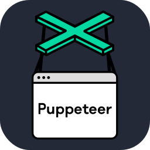 |
|                      |                      |                      |                      | pycharm-auto         |  |
|                      |                      |                      |                      | python-auto          |  |
|                      |                      |                      |                      | pytorch-auto         |  |
|                      |                      |                      |                      | pyxel-auto           |  |
|                      |                      |                      |                      | qodana-auto          |  |
|                      |                      |                      |                      | qt-auto              |  |
|                      |                      |                      |                      | r-auto               |  |
|                      |                      |                      |                      | rabbitmq-auto        |  |
|                      |                      |                      |                      | rails                |  |
|                      |                      |                      |                      | raspberrypi-auto     | 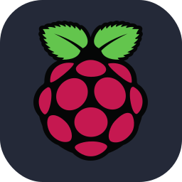 |
|                      |                      |                      |                      | react-auto           |  |
|                      |                      |                      |                      | reactivex-auto       |  |
|                      |                      |                      |                      | reactquery-auto      |  |
|                      |                      |                      |                      | recoil               |  |
|                      |                      |                      |                      | redhat-auto          |  |
|                      |                      |                      |                      | redis-auto           |  |
|                      |                      |                      |                      | redshift-auto        |  |
|                      |                      |                      |                      | redux                |  |
|                      |                      |                      |                      | regex-auto           |  |
|                      |                      |                      |                      | remix-auto           |  |
|                      |                      |                      |                      | replit-auto          |  |
|                      |                      |                      |                      | resharper-auto       |  |
|                      |                      |                      |                      | reverb               |  |
|                      |                      |                      |                      | rider-auto           |  |
|                      |                      |                      |                      | robloxstudio         |  |
|                      |                      |                      |                      | rocket               |  |
|                      |                      |                      |                      | rollupjs-auto        |  |
|                      |                      |                      |                      | ros-auto             | 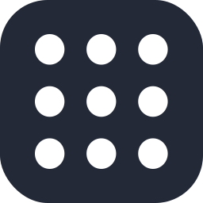 |
|                      |                      |                      |                      | rubocop-auto         |  |
|                      |                      |                      |                      | ruby                 |  |
|                      |                      |                      |                      | rubymine-auto        |  |
|                      |                      |                      |                      | rust-auto            |  |
|                      |                      |                      |                      | rustrover-auto       |  |
|                      |                      |                      |                      | safari-auto          |  |
|                      |                      |                      |                      | sail                 |  |
|                      |                      |                      |                      | sanctum              |  |
|                      |                      |                      |                      | sass                 |  |
|                      |                      |                      |                      | scala-auto           |  |
|                      |                      |                      |                      | scikitlearn-auto     |  |
|                      |                      |                      |                      | scipy-auto           | 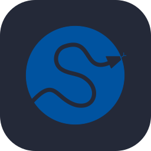 |
|                      |                      |                      |                      | scout                |  |
|                      |                      |                      |                      | scratch              |  |
|                      |                      |                      |                      | seaborn-auto         |  |
|                      |                      |                      |                      | selenium             |  |
|                      |                      |                      |                      | sentry               |  |
|                      |                      |                      |                      | sequelize-auto       |  |
|                      |                      |                      |                      | sharepoint-auto      |  |
|                      |                      |                      |                      | shopify-auto         |  |
|                      |                      |                      |                      | skeletonui-auto      |  |
|                      |                      |                      |                      | sketchup-auto        |  |
|                      |                      |                      |                      | slack-auto           |  |
|                      |                      |                      |                      | snowflake-auto       |  |
|                      |                      |                      |                      | snyk-auto            |  |
|                      |                      |                      |                      | socialite            |  |
|                      |                      |                      |                      | solidity             |  |
|                      |                      |                      |                      | solidjs-auto         |  |
|                      |                      |                      |                      | spark                |  |
|                      |                      |                      |                      | spring-auto          |  |
|                      |                      |                      |                      | sqlite               |  |
|                      |                      |                      |                      | sqlserver-auto       |  |
|                      |                      |                      |                      | stackoverflow-auto   |  |
|                      |                      |                      |                      | stock                |  |
|                      |                      |                      |                      | storyblok-auto       |  |
|                      |                      |                      |                      | storybook-auto       |  |
|                      |                      |                      |                      | strapi               |  |
|                      |                      |                      |                      | streamlit-auto       |  |
|                      |                      |                      |                      | styledcomponents     |  |
|                      |                      |                      |                      | sublime-auto         |  |
|                      |                      |                      |                      | supabase-auto        |  |
|                      |                      |                      |                      | surrealdb-auto       | 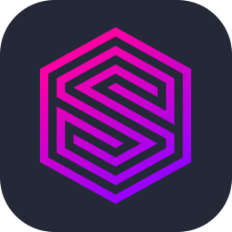 |
|                      |                      |                      |                      | svelte               |  |
|                      |                      |                      |                      | svg-auto             |  |
|                      |                      |                      |                      | svn                  |  |
|                      |                      |                      |                      | swagger-auto         |  |
|                      |                      |                      |                      | swift                |  |
|                      |                      |                      |                      | symfony-auto         |  |
|                      |                      |                      |                      | tableau-auto         |  |
|                      |                      |                      |                      | tailwindcss-auto     |  |
|                      |                      |                      |                      | tallyprime           |  |
|                      |                      |                      |                      | tauri-auto           |  |
|                      |                      |                      |                      | teams-auto           |  |
|                      |                      |                      |                      | telescope            |  |
|                      |                      |                      |                      | tensorflow-auto      | 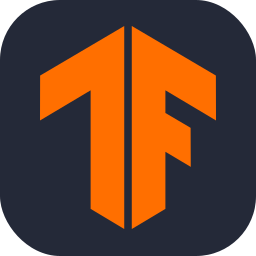 |
|                      |                      |                      |                      | terraform-auto       |  |
|                      |                      |                      |                      | testinglibrary-auto  |  |
|                      |                      |                      |                      | threejs-auto         |  |
|                      |                      |                      |                      | tor-auto             |  |
|                      |                      |                      |                      | trpc                 |  |
|                      |                      |                      |                      | truffle-auto         |  |
|                      |                      |                      |                      | typescript           |  |
|                      |                      |                      |                      | ubuntu               |  |
|                      |                      |                      |                      | unity-auto           |  |
|                      |                      |                      |                      | unrealengine         |  |
|                      |                      |                      |                      | v-auto               |  |
|                      |                      |                      |                      | vala                 |  |
|                      |                      |                      |                      | vapor                |  |
|                      |                      |                      |                      | vercel-auto          |  |
|                      |                      |                      |                      | vim-auto             |  |
|                      |                      |                      |                      | visualbasic-auto     |  |
|                      |                      |                      |                      | visualstudio-auto    |  |
|                      |                      |                      |                      | vite-auto            |  |
|                      |                      |                      |                      | vitest-auto          |  |
|                      |                      |                      |                      | vscode-auto          |  |
|                      |                      |                      |                      | vscodium-auto        |  |
|                      |                      |                      |                      | vuejs-auto           |  |
|                      |                      |                      |                      | vuetify-auto         |  |
|                      |                      |                      |                      | vyper-auto           |  |
|                      |                      |                      |                      | webassembly          |  |
|                      |                      |                      |                      | webflow              |  |
|                      |                      |                      |                      | webpack-auto         |  |
|                      |                      |                      |                      | webstorm-auto        |  |
|                      |                      |                      |                      | windicss-auto        |  |
|                      |                      |                      |                      | windows-auto         |  |
|                      |                      |                      |                      | word-auto            |  |
|                      |                      |                      |                      | wordpress            |  |
|                      |                      |                      |                      | workers-auto         |  |
|                      |                      |                      |                      | x-auto               |  |
|                      |                      |                      |                      | xcode-auto           |  |
|                      |                      |                      |                      | xd                   |  |
|                      |                      |                      |                      | yaml-auto            |  |
|                      |                      |                      |                      | yammer-auto          |  |
|                      |                      |                      |                      | yarn-auto            |  |
|                      |                      |                      |                      | yew-auto             |  |
|                      |                      |                      |                      | youtube              |  |
|                      |                      |                      |                      | zed-auto             |  |
|                      |                      |                      |                      | zig-auto             |  |

<!-- END ICONS LIST -->
---

## 💖 Support the Project

Thank you so much already for using my projects!

To support the project directly, feel free to open issues for icon suggestions, or contribute with a pull request!
